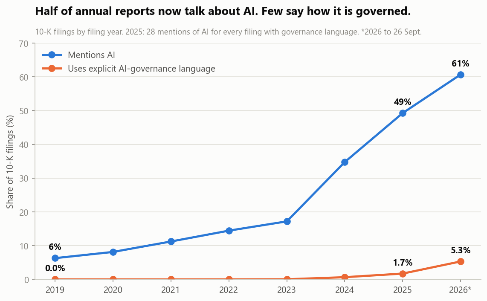
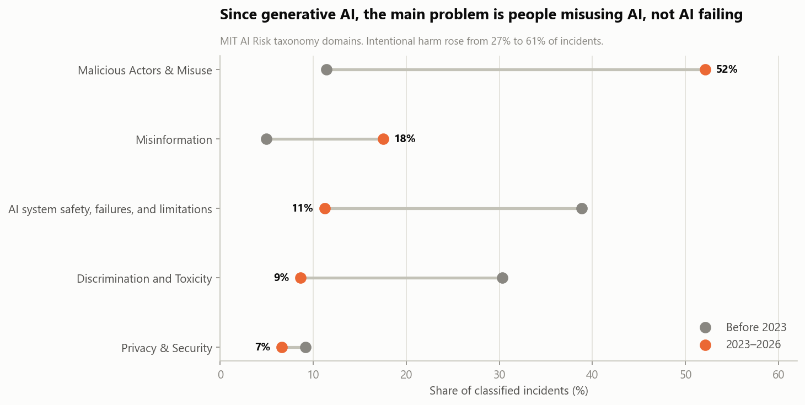
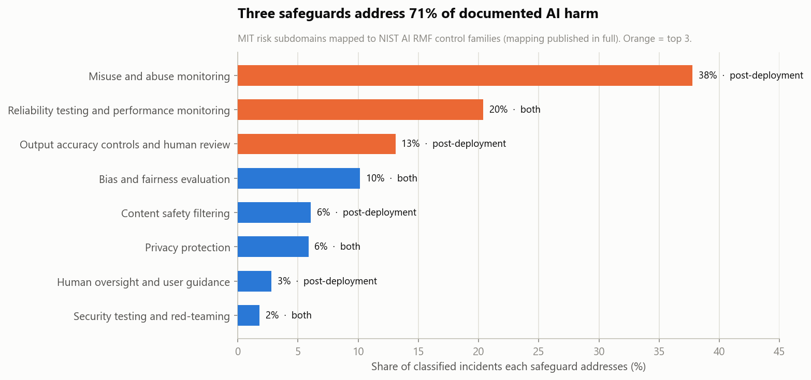
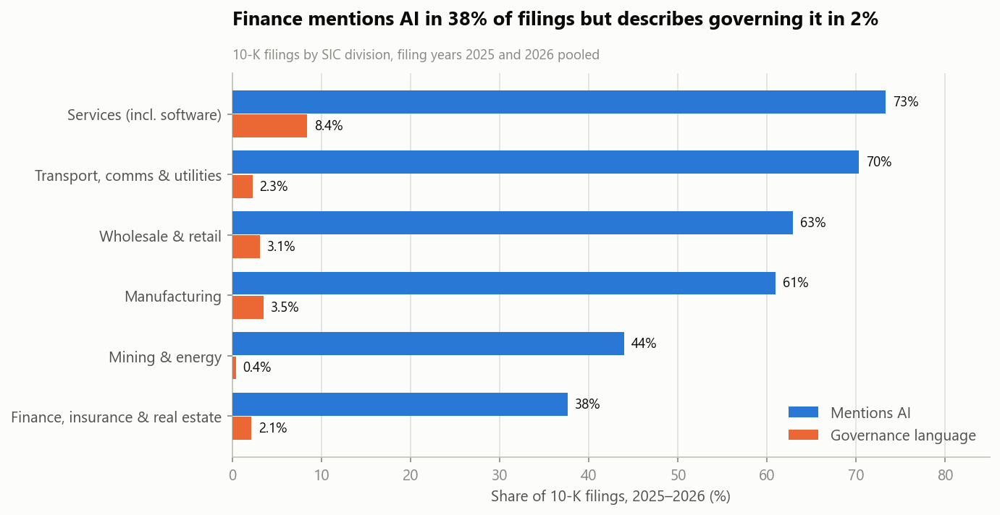

# The AI Oversight Gap

**Companies are telling investors about AI. Are they telling them how it's governed, and is governance aimed at what actually goes wrong?** Every 10-K filed 2019 – Sept 2026, set against 1,689 documented AI incidents.

```bash
python verify.py
```

Fetches the AI Incident Database export (hash-checked), rebuilds every result, and asserts all 12 published figures. About 10 seconds.

Read [MEMO.md](MEMO.md) for the findings.

---

## Headline findings

- **28 to 1:** in 2025, 49% of 10-Ks mentioned AI and 1.7% used explicit AI-governance language. By Sept 2026 it was 61% against 5.3%, or 11 to 1.
- **98% of documented AI harms arose after deployment** (1,460 of 1,496 classified incidents, against 27 before).
- **Misuse overtook malfunction.** Deliberate misuse rose from 11% of incidents before 2023 to 52% since, while AI system failures fell from 39% to 11%.
- **Three safeguards cover 71% of documented harm:** misuse monitoring (38%), reliability testing and monitoring (20%), and output accuracy review (13%).
- **Finance mentions AI in 38% of filings but describes governing it in 2%.**









## Method

| Step | Script | What it does |
|---|---|---|
| 0a | `src/fetch_aiid.py` | Downloads the AIID export from AIID's host and checks its SHA-256 |
| 0b | `src/fetch_sec.py` | Queries SEC EDGAR full-text search for three phrase sets, 2019–2026, and collapses hits to unique filings |
| 1 | `src/incidents.py` | Incident trends, MIT-taxonomy mix by era, safeguard mapping and ranking |
| 2 | `src/disclosures.py` | Disclosure trend, governance language in the report body vs exhibits, sector breakdown |
| 3 | `src/charts.py` | Five charts |

**Choices that matter:**
- **Filings, not documents.** EDGAR returns one hit per document; every hit is collapsed to its accession number.
- **Expert labels.** Incidents use the MIT AI Risk Repository classification already in AIID, not a new model.
- **An open mapping.** The safeguard mapping (MIT subdomain to NIST AI RMF control family) is published in full in `output/safeguard_mapping.csv`.
- **Integrity tests** confirm the denominator is sound and that no risk subdomain is silently dropped.

## Data

- **SEC EDGAR full-text search** ([efts.sec.gov](https://efts.sec.gov/LATEST/search-index)), public domain. The filing-level extract (`data/raw/sec_10k_hits.csv`) is included and hash-pinned.
- **AI Incident Database** ([incidentdatabase.ai](https://incidentdatabase.ai/research/snapshots)), CC BY-SA 4.0. The raw export isn't redistributed, because it includes report text outside that license; `fetch_aiid.py` downloads it. Derived incident tables are shared under CC BY-SA 4.0 with attribution.

## Requirements

Python 3.10+, `pandas`, `numpy`, `matplotlib`, `openpyxl`.

## Limitations

- Incidents are those publicly reported, which skews toward newsworthy consumer harm.
- Governance language is identified by exact phrases, so companies using other wording are missed.
- 2026 runs to 26 Sept 2026.
- The safeguard mapping is a judgement call, published so it can be challenged.
